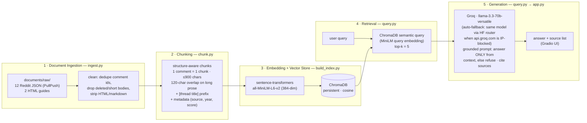

# Project 1 Planning: The Unofficial Guide

> Write this document before you write any pipeline code.
> Your spec and architecture diagram are what you'll use to direct AI tools (Claude, Copilot, etc.) to generate your implementation — the more specific they are, the more useful the generated code will be.
> Update the Retrieval Approach and Chunking Strategy sections if you change your approach during implementation.
> Update this file before starting any stretch features.

---

## Domain

**Student-shared knowledge about housing at UC Berkeley.** The official housing site tells you the application deadline; it does not tell you that students warn *never* to decline your housing offer, that one notorious property company operates under at least eight different names, or what a room in a shared apartment actually costs this year. That knowledge lives in scattered r/berkeley threads spanning 2019–2025, where it is nearly impossible to find on demand — Reddit's search is weak, threads go stale, and the best answers are buried in comment #47. This system makes that folklore searchable and answerable with citations.

---

## Documents

14 documents collected in Milestone 1 (see `documents/SOURCES.md` for the full manifest, collection method, and skim notes). Reddit blocks scrapers, so threads were pulled from the PullPush archive API (`api.pullpush.io`) and saved as one raw JSON file per thread (submission + all archived comments, unmodified). The two web guides were saved as raw HTML with curl.

| # | Source | Description | URL or location |
|---|--------|-------------|-----------------|
| 1 | r/berkeley thread (2022) | "Good time to look for housing?" — when to start the fall apartment search | `documents/raw/reddit_apartment-timeline.json` · [reddit.com/…/t16je2](https://www.reddit.com/r/berkeley/comments/t16je2/good_time_to_look_for_housing/) |
| 2 | r/berkeley thread (2019) | "How exactly does housing work?" — freshman housing application/lottery mechanics | `documents/raw/reddit_housing-lottery.json` · [reddit.com/…/bf0l31](https://www.reddit.com/r/berkeley/comments/bf0l31/how_exactly_does_housing_work/) |
| 3 | r/berkeley thread (2020) | "Pros/cons of living in northside vs southside" | `documents/raw/reddit_northside-southside.json` · [reddit.com/…/f4iex8](https://www.reddit.com/r/berkeley/comments/f4iex8/proscons_of_living_in_northside_vs_southside/) |
| 4 | r/berkeley thread (2022) | "Exposing the CO-OPs / Casa Zimbabwe" — long first-person co-op exposé + rebuttals | `documents/raw/reddit_coops-bsc.json` · [reddit.com/…/tcreyk](https://www.reddit.com/r/berkeley/comments/tcreyk/exposing_the_coops_casa_zimbabwe/) |
| 5 | r/berkeley thread (2023) | "PSA: DO NOT RENT WITH RAJ PROPERTIES" — 701-point landlord warning, alias company names | `documents/raw/reddit_landlords.json` · [reddit.com/…/12f4qqb](https://www.reddit.com/r/berkeley/comments/12f4qqb/psa_do_not_rent_with_raj_properties/) |
| 6 | r/berkeley thread (2023) | "How much do you pay in rent?" — 44 crowdsourced price points with unit types | `documents/raw/reddit_rent-prices.json` · [reddit.com/…/11503dk](https://www.reddit.com/r/berkeley/comments/11503dk/how_much_do_you_pay_in_rent_i_want_some_rent/) |
| 7 | r/berkeley thread (2023) | "Parents posting for their kid's housing" — roommate-search channels and norms | `documents/raw/reddit_roommates.json` · [reddit.com/…/12scrpc](https://www.reddit.com/r/berkeley/comments/12scrpc/parents_posting_for_their_kids_housing/) |
| 8 | r/berkeley thread (2025) | "What are the more dangerous parts of Berkeley?" — area-by-area safety experiences | `documents/raw/reddit_safety.json` · [reddit.com/…/1ih8viq](https://www.reddit.com/r/berkeley/comments/1ih8viq/what_are_the_more_dangerous_parts_of_berkeley/) |
| 9 | r/berkeley thread (2022) | "URGENT: how to switch out of 'blackwell'" — dorm comparisons (Blackwell, Units 1–3, Foothill, Clark Kerr) | `documents/raw/reddit_freshman-dorms.json` · [reddit.com/…/v1xbix](https://www.reddit.com/r/berkeley/comments/v1xbix/urgent_how_to_switch_out_of_blackwell/) |
| 10 | r/berkeley thread (2022) | "Subletter denies me of housing last minute…" — sublease pitfalls and recovery channels | `documents/raw/reddit_subletting.json` · [reddit.com/…/upw41v](https://www.reddit.com/r/berkeley/comments/upw41v/subletter_denies_me_of_housing_last_minute/) |
| 11 | r/berkeley thread (2022) | "Signing a lease without actually seeing the place?" — sight-unseen leases and scam avoidance | `documents/raw/reddit_scams.json` · [reddit.com/…/wkkkiu](https://www.reddit.com/r/berkeley/comments/wkkkiu/please_help_signing_a_lease_without_actually/) |
| 12 | r/berkeley thread (2023) | "How's the BART? Is it viable as a commute option?" — commuting from Oakland/East Bay, fares, transit | `documents/raw/reddit_commute-nearby.json` · [reddit.com/…/13b5bve](https://www.reddit.com/r/berkeley/comments/13b5bve/hows_the_bart_is_it_viable_as_a_commute_option/) |
| 13 | Berkeley Life web guide | "Off-Campus Housing Search Tips" — official-adjacent student guide (timeline, Cal Rentals/OCH, neighborhoods) | `documents/raw/web_offcampus_search_tips.html` · [life.berkeley.edu](https://life.berkeley.edu/off-campus-housing-search-tips/) |
| 14 | Berkeley Life web guide | "Finding Housing Off Campus: What to Expect" — student Q&A on timeline, budget, scams | `documents/raw/web_housing_what_to_expect.html` · [life.berkeley.edu](https://life.berkeley.edu/finding-housing-what-to-expect/) |

Together these cover eight distinct subtopics (timeline, lottery, neighborhoods, co-ops, landlords, prices, safety, sublets/scams/commuting) plus two non-Reddit perspectives, so different query types hit different documents rather than everything matching one mega-source.

---

## Chunking Strategy

**Chunk size:** structure-aware, target ≤ 900 characters (roughly ≤ 225 tokens). One chunk per Reddit comment; submission selftexts, web-guide sections, and the handful of comments that exceed 900 characters (12 in this corpus) split on paragraph boundaries into ~900-character pieces — a split never mixes text from two authors. Very short comments (< 120 characters) are dropped unless they are top-level replies of ≥ 15 characters — a cheap approximation of "directly answers the thread title" that keeps data-bearing one-liners like "800 single 2 blocks" in the rent thread, at the cost of admitting some top-level filler (accepted tradeoff; filtering filler *semantically* would require an LLM judge in the ingestion path).

**Overlap:** 120 characters, applied **only** when splitting long continuous prose (long selftexts like the Casa Zimbabwe exposé, web-guide sections, and oversized single comments). No overlap between comments — they are independent utterances by different authors, and overlapping them would bleed one person's opinion into another's chunk.

**Reasoning:** This corpus has two very different document shapes, so a single fixed character split (e.g., "every 500 chars") would be wrong for both:

- **Reddit comments are already natural chunks.** The typical substantive comment (150–600 chars) is one self-contained thought: a price point, a landlord warning, a timeline opinion. Fixed splitting would cut them mid-sentence (fragments carry no semantic signal) or, worse, concatenate unrelated comments from different authors into one chunk — a retrieval match on one author's sentence would drag in another author's unrelated claim, and attribution would break.
- **Long-form prose needs splitting.** The Casa Zimbabwe selftext and the web guides run to thousands of characters covering multiple sub-claims. Unsplit, they would dilute into "about everything" embeddings that match every query weakly and no query strongly. The 900-char cap keeps each piece about one sub-topic; the 120-char overlap protects facts that straddle a paragraph split boundary so at least one chunk keeps the full sentence.

**Context prefix:** every chunk is prefixed with its thread/guide title (e.g., `[PSA: DO NOT RENT WITH RAJ PROPERTIES]`), because a comment like "Avoid them at all costs, they kept my entire deposit" is meaningless — and unembeddable — without knowing what "them" refers to. The prefix injects the topic into the embedding.

**Preprocessing before chunking** (from the skim notes in `documents/SOURCES.md`):
- Reddit JSON: drop `[deleted]`/`[removed]` bodies; **dedupe comments by id** (the PullPush archive returns duplicate live/deleted records for the same comment in 3 files); unescape HTML entities (`&amp;`, `&#x200B;`); strip markdown link syntax and zero-width characters.
- Web guides: strip tags/nav/footer boilerplate, keep headings (they become section titles) and body paragraphs.

**Metadata attached to every chunk:** source file, document title, source type (`reddit_thread` / `web_guide`), thread year, comment score (where applicable), and position in document — needed for citation, for the evaluation report, and for the metadata-filtering stretch feature.

**Expected chunk count:** the corpus has 466 unique live comments, of which ~210 clear the 120-character bar outright and up to ~120 more could survive via the direct-answer exception; add ~20 selftext pieces and ~25 guide sections ≈ **250–380 chunks** — comfortably inside the healthy 50–2,000 range for a corpus this size. Actual count will be recorded in the README after Milestone 3.

---

## Retrieval Approach

**Embedding model:** `all-MiniLM-L6-v2` via `sentence-transformers` — runs locally, no API key, 384-dim embeddings, 256-token effective input window. That window fits our ≤ 900-char chunks with room to spare, which is part of why the chunk cap was set there.

**Vector store:** ChromaDB, persistent local collection (`chroma_db/`), cosine distance.

**Top-k:** **5.** With per-comment chunks, a single relevant comment rarely tells the whole story (e.g., the rent thread's answer is a distribution across many comments), so k must be > 2; but beyond ~5–6 chunks the context starts admitting weak matches (distance > 0.7) that pull generation off-target. k=5 also keeps total context ≈ 4,500 chars — trivial for the LLM's window. Will revisit after Milestone 4 retrieval testing if results look starved or diluted.

**Production tradeoff reflection:** If this were deployed for real users (and cost weren't the deciding factor), I would weigh:
- **Accuracy on informal text:** MiniLM is trained on general sentence pairs; slang-heavy Reddit prose (this corpus includes "traphouse" for a run-down group house and "fish" for unofficial co-op residents) is out-of-distribution. A larger model (e.g., `bge-large`, OpenAI `text-embedding-3-large`, Cohere embed-v4) would likely retrieve idiomatic content better — worth an A/B on our eval set before switching.
- **Context length:** MiniLM truncates at ~256 tokens, which forces small chunks. A long-context embedding model would permit whole-comment-tree chunks and fewer boundary artifacts.
- **Local vs. API:** local means zero per-query cost, no data leaves the machine (student posts are public but user *queries* may be sensitive — "is my landlord scamming me"), and no rate limits; API models cost per token, add ~100–300 ms latency and an availability dependency, but ship better accuracy with no ops burden. For a campus-scale free tool I'd stay local (maybe upgrade to `bge-small`/`gte-base`); for a monetized product I'd benchmark API models first.
- **Multilingual support:** matters if we ingest content from international-student groups (WeChat/KakaoTalk housing groups); MiniLM is English-only, `multilingual-e5` or API models would handle code-switched posts.

---

## Evaluation Plan

Five questions, each answerable from a specific document in the corpus, with expected answers concrete enough to grade against. Difficulty is deliberately graded — Q1–Q2 are single-chunk lookups, Q3 requires cross-document synthesis, Q4 is a comparison, and Q5 requires aggregating many scattered data points (chosen specifically because top-k retrieval plausibly fails at aggregation; the evaluation should be able to surface a failure).

| # | Question | Expected answer |
|---|----------|-----------------|
| 1 | How much does a one-way BART ride from Oakland to Berkeley cost, and which transit is free for Cal students? | About **$2.25 one-way** (a commenter corrects the OP's $6.90 assumption), and **AC Transit buses are free for Cal students** (included in student fees). No general BART discount for students — only a randomized pilot program. *(Source: reddit_commute-nearby, 2023)* |
| 2 | Which other company names do students say Raj Properties operates under? | **At least 3 of:** Everest Properties, URSA Apartments, Domingo Properties, University Walk Apartments, Berkeley Park Apartments, A.S.K. Rentals, Square One Management, Anchor Valley Partners (from the 72-point comment listing aliases; replies note Everest was renamed Domingo, and dispute whether URSA/Square One/Anchor Valley are really Raj — a great answer reflects that dispute). *(Source: reddit_landlords, 2023)* |
| 3 | What do students warn will happen if you decline your UC Berkeley on-campus housing offer? | **Never decline** — you'd be left with only ~1.5 months to scramble for your own housing; once you decline "that's it," you can only request a swap while actually holding an assignment. *(Sources: reddit_housing-lottery 2019 + reddit_freshman-dorms 2022 — answer spans two documents)* |
| 4 | How do students compare Blackwell Hall and Unit 3 as freshman dorms? | **Blackwell**: newest hall, "objectively the best dorm facilities-wise" — study rooms, private gym, pool/table-tennis tables. **Unit 3**: "probably the worst facilities-wise but has a good location and is very social," and cheaper. *(Source: reddit_freshman-dorms, 2022)* |
| 5 | What does a room in a shared apartment near campus typically cost, according to students? | From the 2023 rent-transparency thread: private rooms in shared apartments mostly **$800–$1,500/month** (e.g., $800 single 2 blocks away, $1,000 incl. utilities near Willard Park, $1,225–$1,300 for singles in 2b/1ba, $1,500 at Panoramic), studios ~$1,550–$2,870, 1b1b ~$2,200–$2,540. Graded correct if the response gives a range consistent with these numbers, cites concrete examples, and attributes prices to the 2023 thread. *(Source: reddit_rent-prices, 2023)* |

---

## Anticipated Challenges

1. **Aggregation questions vs. top-k retrieval (rent prices).** The "typical rent" answer is a *distribution* across 44 comments, but k=5 retrieval sees at most 5 of them — and semantic similarity doesn't prefer *representative* price points, so the system may extrapolate a range from an unrepresentative sample (e.g., the $575 converted-closet outlier or the $3,152 SF luxury unit) and present it confidently. This is the question I most expect to produce the required failure case.
2. **Archive noise and duplicate comments.** PullPush returns duplicate live/deleted records for the same comment id in 3 files, plus `[deleted]` bodies and joke one-liners. Without id-dedup and a minimum-length filter, retrieval can return the same text twice (wasting 2 of 5 context slots) or surface an unrepresentative aside (the "$575 for a 63 sq foot concerted closet in a rent controlled house. go bears" comment) as if it were typical pricing advice.
3. **One-sided sources and irony read as fact.** The Casa Zimbabwe exposé is a single aggrieved author's 6,500-character account, and several of its claims are disputed in the replies; likewise, replies in the landlord thread dispute whether some of the listed "Raj alias" companies are actually Raj. A grounded answer can faithfully relay a disputed or ironic claim as settled fact — grounding enforces *provenance*, not *accuracy of the source itself*. The README should be explicit about this limitation.
4. **Temporal staleness presented as current.** Lottery mechanics are from 2019, rents from 2023, safety reports from 2025. A user asking "what's the housing deadline" could get a 2019 date stated as fact. Mitigation: every chunk carries its thread year in metadata, the generation prompt is instructed to attribute years ("in a 2023 thread…"), and citations always show the source document.
5. **Referential comments need their thread context.** Comments like "avoid them at all costs" embed poorly and answer nothing on their own. Mitigation is the `[thread title]` prefix on every chunk — but if a comment refers to *another comment* (not the thread topic), the prefix won't rescue it and retrieval may surface it uninterpretably.

---

## Architecture

---

## AI Tool Plan

The AI tool for all milestones is **Claude (Claude Code CLI)**. The pattern for every component: I provide the relevant sections of this spec as the prompt, review the generated code against the spec line-by-line, run it on the real corpus, and inspect actual outputs before moving on. Verification criteria are listed per milestone.

**Milestone 3 — Ingestion and chunking:**
- *Input to AI:* the Documents + Chunking Strategy sections above, the skim notes from `documents/SOURCES.md` (including the duplicate-comment-id and empty-selftext quirks), and the architecture diagram.
- *Expected output:* `ingest.py` (raw JSON/HTML → cleaned document records) and `chunk.py` (records → chunks with metadata), implementing exactly the sizes/overlap/prefix rules specified here.
- *Verification:* print 5 random chunks and check them against the good/bad chunk criteria (self-contained, no HTML artifacts, correct source metadata); confirm dedup actually removed the known duplicate ids in `reddit_landlords.json`; confirm total chunk count lands in the 250–380 estimate (investigate if far off).

**Milestone 4 — Embedding and retrieval:**
- *Input to AI:* the Retrieval Approach section, the chunk schema from Milestone 3, and the architecture diagram.
- *Expected output:* `build_index.py` (embed all chunks into a persistent ChromaDB collection with metadata) and a `retrieve(query, k=5)` function in `query.py` returning chunks + sources + distances.
- *Verification:* run evaluation questions 1, 2, and 4 as retrieval-only queries; require visibly on-topic chunks with top-1 distance < 0.5, and correct source attribution on every hit. If retrieval fails here, fix chunking/embedding before touching generation.

**Milestone 5 — Generation and interface:**
- *Input to AI:* the grounding requirement (answer only from retrieved context; refuse when context is insufficient; cite sources), the output contract (`ask(question) → {answer, sources}`), and the Gradio skeleton from the project instructions.
- *Expected output:* `query.py`'s `ask()` wiring retrieval → Groq `llama-3.3-70b-versatile` with a grounding system prompt, and `app.py` (Gradio UI showing answer + retrieved sources).
- *Verification:* the two-sided test — (a) on-corpus queries must produce answers traceable to retrieved chunks with sources named in the output text; (b) an off-corpus query ("best CS professor?") must produce an explicit refusal, not general knowledge. I will also check the code enforces attribution programmatically (sources appended from retrieval metadata, not left to the LLM's discretion).

**Milestone 6 — Evaluation:** run the 5 questions above end-to-end myself and grade against the expected answers; AI is used only to help analyze *why* a failure happened, not to grade its own output.

---

## Stretch Features

*(This section is updated before starting each stretch feature, per the project instructions.)*

### Stretch A — Hybrid Search (BM25 + semantic)

**Motivation (from the Milestone 6 failure):** eval Q3 failed because the answering chunk ranked 8th semantically — the query's phrasing pulled guide sections into the top 5. But the query and the answer share a rare literal token: only 5 chunks in the whole corpus contain the word "decline". A lexical scorer should rank that chunk near the top. Hypothesis: **hybrid retrieval fixes Q3 without hurting the queries semantic search already wins.**

**Approach:** BM25 (via `rank-bm25`, tokenized on lowercased word boundaries) over all 387 chunk texts, fused with semantic search using **Reciprocal Rank Fusion**: each retriever returns its top-20, and a chunk's fused score is Σ 1/(60 + rank) across the two lists. RRF is chosen over weighted score mixing because BM25 scores and cosine distances live on incomparable scales — rank fusion needs no normalization or tuned weight.

**Plan:** implement in `hybrid.py` (`retrieve_bm25`, `retrieve_hybrid`); add a retrieval-mode toggle to `ask()` and the Gradio UI; compare semantic-only vs BM25-only vs hybrid on at least 3 queries including failing Q3 and two queries semantic already handles well (Q1 BART fare, Q2 Raj aliases) to check for regressions; report which method wins per query in the README.

**Verification:** re-run eval Q3 end-to-end in hybrid mode — success = the system answers with the DO-NOT-DECLINE warning and cites the housing-lottery thread instead of refusing.

### Stretch B — Chunking Strategy Comparison

**Question:** does the structure-aware chunking actually beat the naive approach the project instructions warn against ("split every 500 characters"), or was that engineering effort wasted?

**Strategies compared on the same cleaned documents:**
- **A (production):** structure-aware — 1 comment = 1 chunk, ≤900-char pieces, 120-char overlap on long prose only, `[thread title]` prefix, short-comment filter. 387 chunks.
- **B (naive fixed):** each document's cleaned text concatenated (title, selftext, comments in order), sliced into fixed 500-char windows with 100-char overlap. No comment boundaries, no per-chunk title prefix, no filtering.

**Method:** same query set = the 5 evaluation questions. Both chunk sets embedded with the same model (all-MiniLM-L6-v2), ranked by cosine similarity per query. Objective metric: **hit@5** — does any top-5 chunk contain the known answer marker (e.g., "2.25" for Q1, "DO NOT DECLINE" for Q3, "objectively the best dorm" for Q4)? Plus the rank of the first answering chunk. Markers are graded against the *retrieval* stage because generation can't fix retrieval misses (Milestone 4 lesson).

**Hypothesis:** A wins on precision-style questions because B's windows cut sentences mid-thought and bleed adjacent authors together, diluting embeddings; B might accidentally win where merging neighbors pulls related short comments into one window. Whatever the data says gets reported.

**Implementation:** `compare_chunking.py` — builds strategy-B chunks in memory, embeds both sets fresh, prints the per-query table for the README.

### Stretch C — Metadata Filtering

**Motivation:** every chunk already carries `source_type` (reddit_thread / web_guide) and `year` metadata, and the corpus genuinely disagrees along those axes — e.g., on the housing-search timeline, 2022 Reddit commenters say start in February while the 2024 student-life guides say 6–8 weeks before move-in is fine. A user should be able to ask "what do the *guides* say?" vs "what does *Reddit* say?" — and "recent info only" mitigates the temporal-staleness risk named in Anticipated Challenges.

**Plan:** add optional `source_type` and `min_year` filters through the whole stack: `retrieve()` passes a ChromaDB `where` clause (`{"source_type": …}`, `{"year": {"$gte": …}}`, `$and` when both); hybrid mode applies the same predicate to the BM25 candidate pool in Python so both retrieval modes respect filters; `ask()` forwards them; the Gradio UI gets a source-type dropdown and a minimum-year dropdown; the CLI gets `--source-type` / `--min-year`.

**Verification (visible effect):** the timeline question run three ways — unfiltered (mixed sources), `source_type=web_guide` (guide advice only), `source_type=reddit_thread` (student advice only) — must return visibly different source lists and answers; `min_year=2025` must restrict results to the 2025 safety thread.
